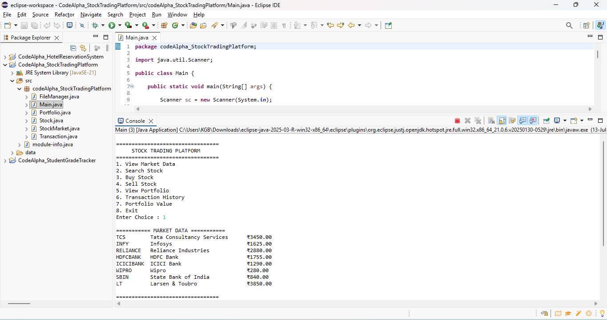
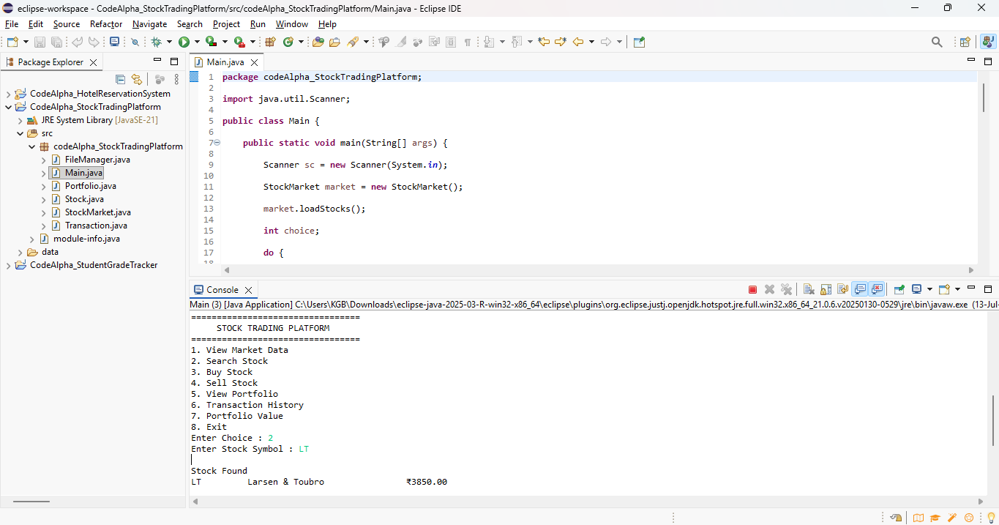
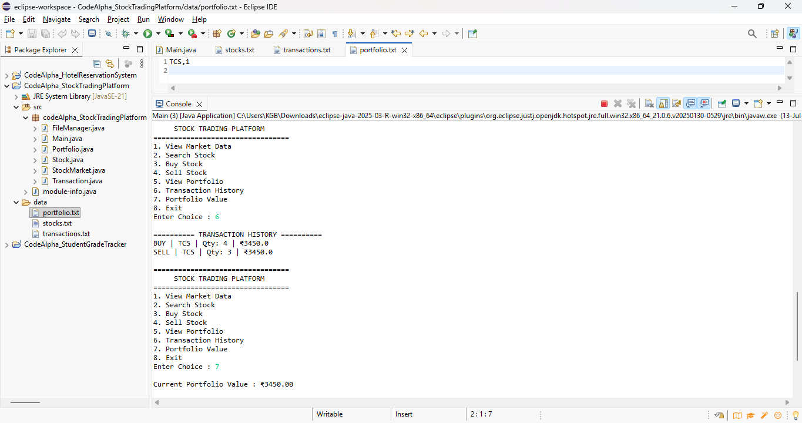

# CodeAlpha - Stock Trading Platform

## 📌 Overview
The Stock Trading Platform is a Java console-based application developed as part of the CodeAlpha Java Programming Internship. It simulates stock market operations by allowing users to buy and sell stocks, manage portfolios, and maintain transaction records using file handling and Object-Oriented Programming.

## ✨ Features
- View available stocks
- Buy stocks
- Sell stocks
- Portfolio management
- Transaction history
- Persistent data storage using text files
- Menu-driven console interface

## 🛠 Technologies Used
- Java
- Eclipse IDE
- Object-Oriented Programming (OOP)
- File Handling
- ArrayList

## 📂 Project Structure

```
CodeAlpha_StockTradingPlatform
│
├── src
│   ├── Main.java
│   ├── Stock.java
│   ├── StockMarket.java
│   ├── Portfolio.java
│   ├── Transaction.java
│   └── ...
│
├── data
│   ├── stocks.txt
│   ├── portfolio.txt
│   └── transactions.txt
│
└── .gitignore
```

## ▶️ How to Run

1. Clone this repository.
2. Open the project in Eclipse or IntelliJ IDEA.
3. Ensure the **data** folder is present.
4. Run `Main.java`.
5. Follow the console menu.

## 🎯 Learning Outcomes
- Java OOP
- File Handling
- Collections
- Exception Handling
- Real-world Project Design

## 📸 Screenshots

### View Available Stocks



---

### Search Stock



---

### Portfolio Overview



## 👩‍💻 Author
**C V Keerthigha**

CodeAlpha Java Programming Internship
