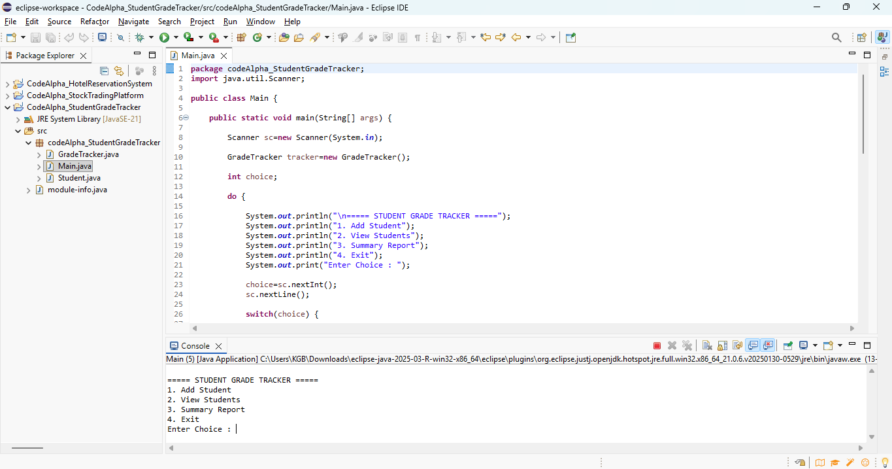
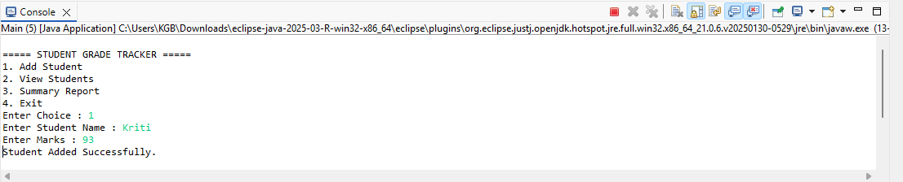
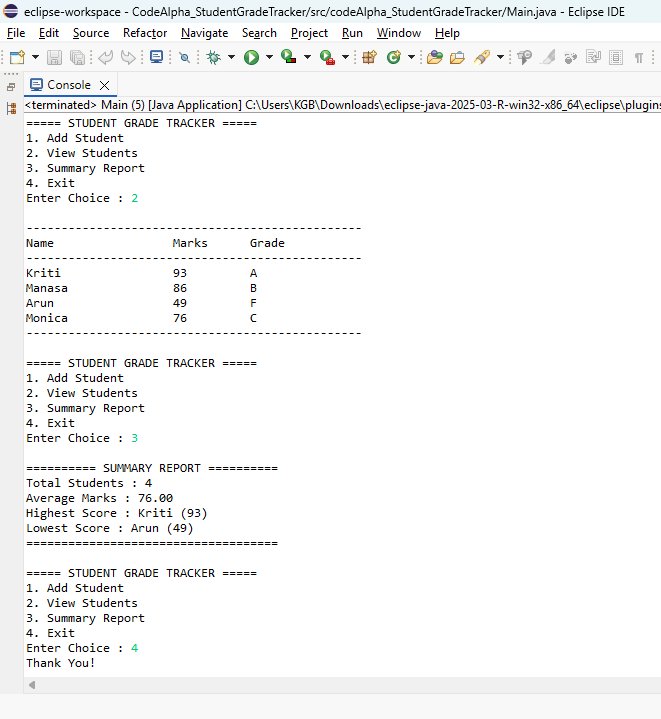

# Student Grade Tracker

A Java console-based application developed as part of the **CodeAlpha Java Programming Internship**.

## Features

- Add student records
- Calculate grades based on marks
- Display all student details
- Menu-driven console interface
- Uses Object-Oriented Programming (OOP)

## Technologies Used

- Java
- Eclipse IDE
- ArrayList
- Object-Oriented Programming

## Project Structure

```
CodeAlpha_StudentGradeTracker
├── src
│   ├── GradeTracker.java
│   ├── Main.java
│   └── Student.java
└── module-info.java
```

## Screenshots

### Main Menu



### Add Student



### Grade Report



## Author

**C V Keerthigha**

CodeAlpha Java Programming Internship
